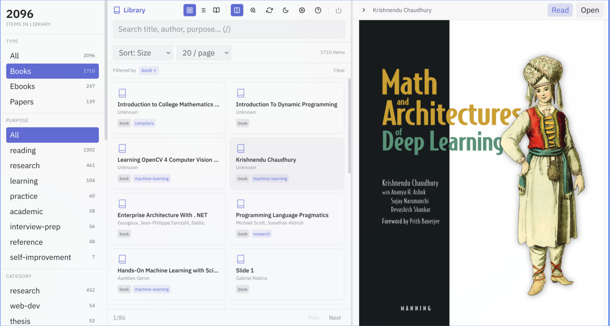
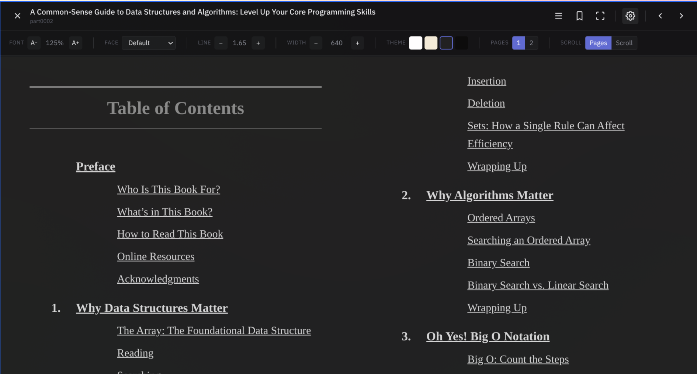
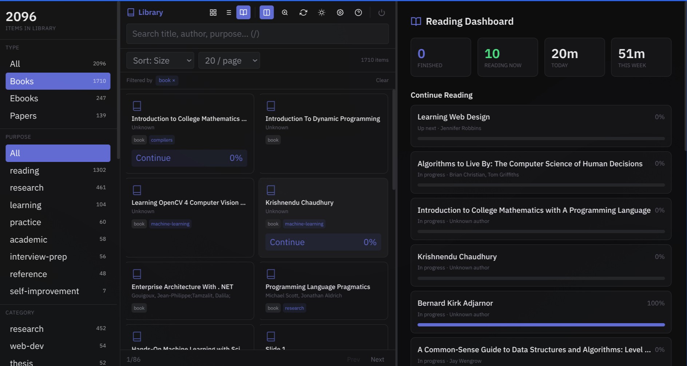
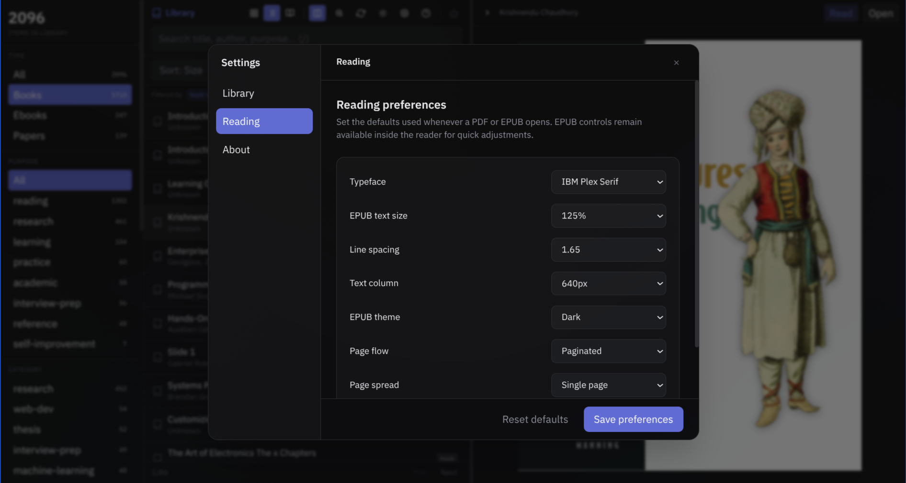

# Library

Library is a local-first reading workspace for books, papers, and technical documents. It indexes folders you choose, extracts useful metadata, and provides fast in-app EPUB and PDF reading with durable progress, bookmarks, search, and queue management.

Integrates with [FocusD](https://github.com/Adjanour/focusd) to pull reading plans and sync completion status.

## What it looks like

| Library and preview | EPUB reader |
| --- | --- |
|  |  |

| Reading dashboard | Reading preferences |
| --- | --- |
|  |  |

## Project status

Library is in public preview. Linux is the currently verified desktop target.
Windows and macOS builds run in CI, but still need native-device EPUB
verification, signing, and installer certification.

The current public artifact is
[`v0.1.1-preview.1`](https://github.com/Adjanour/library/releases/tag/v0.1.1-preview.1).
The Linux installer is experimental, user-owned, and does not require `sudo`.
Small native Desktop Preview setup binaries are available for Linux, Windows,
and macOS; they download the matching verified CEF bundle and require no
administrator access. The browser-only Web Preview remains available as an
explicit fallback. Windows and macOS builds are still unsigned preview
software.
See [release readiness](docs/release-readiness.md) for the certification gates.

## Features

- **Auto-indexing** — scans local directories for PDFs, EPUBs, and other book formats, extracting title, author, tags, and categories
- **Configurable folders** — add or remove watched folders from Settings; choices persist on the device
- **In-app reading** — EPUB and range-streamed PDF readers with durable progress and bookmarks
- **Reading tracking** — start/stop reading sessions, log pages read, track progress per book
- **FocusD sync** — pulls your reading queue from FocusD, marks tasks done when you finish a book
- **Search** — instant full-text search with filters by type, category, tag, and year
- **Keyboard-driven** — full keyboard navigation in the web UI (press `?` for shortcuts)
- **TUI mode** — terminal-based interface using [Bubble Tea](https://github.com/charmbracelet/bubbletea) for quick access without a browser

## Quick start

Requirements:

- Go 1.25 or newer
- Node.js and pnpm
- Deno
- `mise`, recommended for the pinned Zig 0.16.0 installer toolchain
- Optional: Poppler's `pdfinfo` and `pdftotext`, plus `unzip`, for richer metadata extraction

```bash
pnpm install --dir web/svelte --frozen-lockfile
pnpm --dir web/svelte run build
make build
./bin/server --scan
```

The web UI runs at [http://localhost:8080](http://localhost:8080).

### Scan directories

In the Deno web and desktop UI, open Settings to add or remove the folders Library watches. The choices are stored in the local database and restored on restart. The legacy Go server path still uses `Documents`, `Downloads`, and `Books` under the current user's home directory when started with `--scan`; use the Deno UI when you need configurable scan roots.

### Dev mode

```bash
./dev.sh
```

Starts the SvelteKit dev server on port 5173 with hot reload.

## Development commands

Run the checks that match the layer you changed:

```bash
go test ./...
deno check deno/src/**/*.ts
deno task --cwd deno test
pnpm --dir web/svelte run check
pnpm --dir web/svelte run build
mise exec -- zig build test --summary all
bash installer/tests/https_integration.sh
```

Build and smoke-test the desktop bundle on Linux:

```bash
pnpm install --dir web/svelte --frozen-lockfile
pnpm --dir web/svelte run build
deno task --cwd deno check
deno task --cwd deno test
deno task --cwd deno desktop
xvfb-run -a installer/scripts/validate-desktop-launch.sh dist/app/app
```

Use Settings in the app to add or remove scan directories. Paths are validated,
stored in the local database, and reused after restart.

## Platform status

| Platform | Status |
| --- | --- |
| Linux | Build, CEF packaging, and launch validation verified locally and in CI |
| Windows | Native CI build configured; signing, installer metadata, and real-device EPUB verification pending |
| macOS | Native CI build configured; signing, notarization, installer metadata, and real-device EPUB verification pending |

Windows and macOS are build-capable, not release-certified. See [release readiness](docs/release-readiness.md).

## Building

Requires Go 1.25+ and Node.js.

```bash
make build          # build everything
make build-server   # Go server only
make build-tui      # terminal UI only
make build-web      # SvelteKit frontend only
```

### Desktop app

The current desktop flow uses Deno Desktop and the Svelte production build:

```bash
pnpm install --dir web/svelte --frozen-lockfile
pnpm --dir web/svelte run build
deno task --cwd deno check
deno task --cwd deno test
deno task --cwd deno desktop
```

The desktop build uses CEF so EPUB rendering is consistent across platforms. Linux is the currently verified release target; Windows and macOS builds are CI-capable but not release-certified.

## Project guides

- [Contributing](CONTRIBUTING.md) — contributor workflow, checks, and release hygiene.
- [Getting started](docs/getting-started.md) — setup, build, run, and test Library.
- [Web Preview](docs/web-preview.md) — run the local browser release from a small production bundle.
- [Desktop Preview](docs/desktop-preview.md) — install the native CEF preview with the small setup program.
- [Desktop packaging](docs/desktop-packaging.md) — build and validate CEF desktop artifacts.
- [Installer guide](docs/installer.md) — manifests, signatures, caching, versioned installs, and rollback.
- [Release readiness](docs/release-readiness.md) — certification gates for v0.1.1 and later.
- [Preview testing](docs/preview-testing.md) — shareable checklist for Windows, macOS, and Linux testers.
- [Deno Desktop reference](deno/DESKTOP.md) — runtime architecture and configuration.

Metadata extraction currently uses Poppler tools (`pdfinfo`, `pdftotext`) and `unzip` when available. Missing tools degrade to filename metadata rather than preventing the library or in-app readers from working.

## Architecture

```text
cmd/                 Go server, TUI, and file organizer entrypoints
internal/             Go database, API, scanner, metadata, and TUI packages
deno/src/             Local API, SQLite access, scanner orchestration, desktop runtime
deno/tests/           Deno database, platform, cache, reader, and scanner tests
web/svelte/           SvelteKit interface and reader components
installer/            Zig 0.16.0 manifests, downloader, verifier, installer, and rollback
docs/                 Setup, packaging, installer, release, and archived guides
```

The desktop app uses Deno Desktop with the CEF backend. This keeps EPUB
rendering consistent across Linux, Windows, and macOS build targets. The Go
server remains useful for the web and TUI workflows.

## Contributing

Start with [CONTRIBUTING.md](CONTRIBUTING.md), then read the focused guide for
the area you are changing:

- [Getting started](docs/getting-started.md)
- [Desktop packaging](docs/desktop-packaging.md)
- [Installer guide](docs/installer.md)
- [Release readiness](docs/release-readiness.md)
- [Deno Desktop reference](deno/DESKTOP.md)

When changing reader behavior, add a focused test and run the packaged EPUB
smoke test where possible. Treat books as untrusted input. Preserve visible
focus states, keyboard access, bounded cache behavior, cancellation, and
manual metadata corrections. Keep installers user-owned and never make `sudo`
part of the normal install or update flow.

Use focused branch names such as `feature/reader-search`,
`fix/epub-timeout`, or `docs/contributing`. Do not use `codex` as a branch
name.

## Commands

| Binary | Description |
|--------|-------------|
| `bin/server` | Web server + API |
| `bin/tui` | Terminal interface |
| `bin/organize` | File organization utility |

### Server flags

- `-port` — server port (default: `8080`)
- `-scan` — scan and index files before starting
- `-force` — re-parse all files during scan (use with `-scan`)

## API

| Endpoint | Description |
|----------|-------------|
| `GET /api/items` | List all items |
| `GET /api/items/:id` | Get item details |
| `GET /api/search?q=` | Search items |
| `GET /api/reading/progress` | All reading progress |
| `POST /api/reading/progress/:id` | Update reading progress |
| `GET /api/reading/queue` | Reading queue |
| `GET /api/reading/dashboard` | Aggregated stats |

## Project Structure

```
cmd/
  server/         # Web server entrypoint
  tui/            # Terminal UI
  organize/       # File organizer
internal/
  api/            # HTTP handlers
  db/             # SQLite database layer
  models/         # Data types
  scanner/        # File discovery and metadata extraction
  tui/            # Bubble Tea TUI components
  readest/        # Readest integration
web/
  svelte/         # SvelteKit frontend
  static/         # Legacy static assets
```

## Stack

- **Backend:** Go, SQLite ([modernc.org/sqlite](https://pkg.go.dev/modernc.org/sqlite))
- **Frontend:** SvelteKit, Tailwind CSS, TypeScript
- **TUI:** [Bubble Tea](https://github.com/charmbracelet/bubbletea), [Lip Gloss](https://github.com/charmbracelet/lipgloss), [Bubbles](https://github.com/charmbracelet/bubbles)

## Data

The SQLite database follows each platform's application-data convention. Desktop builds use the CEF backend so EPUB rendering behaves consistently across Linux, macOS, and Windows; this trades a larger install for a predictable reading engine.

- Linux: `$XDG_DATA_HOME/library/library.db` or `~/.local/share/library/library.db`
- macOS: `~/Library/Application Support/library/library.db`
- Windows: `%LOCALAPPDATA%\library\library.db`

## License

MIT
